1. Given an array of integers, return indices of the two numbers such that they add up to a specific target.

You may assume that each input would have exactly one solution, and you may not use the same element twice.

[Two Sum](https://leetcode.com/problems/two-sum/)

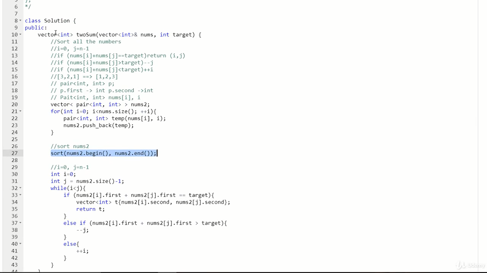

---

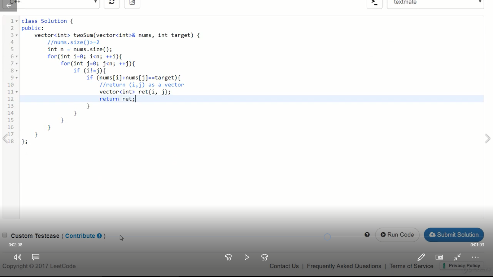

2. Consecutive number of ones

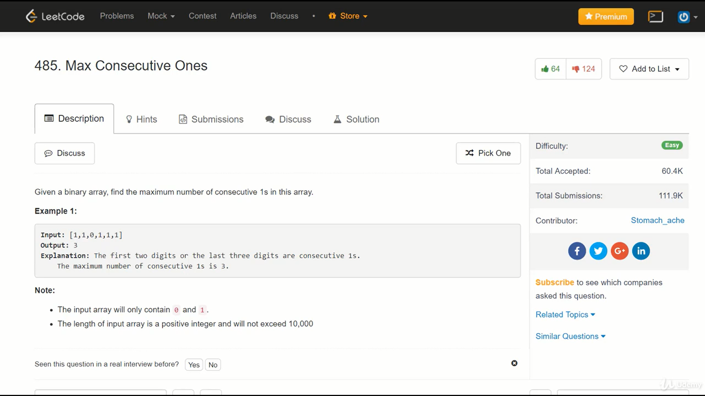

---

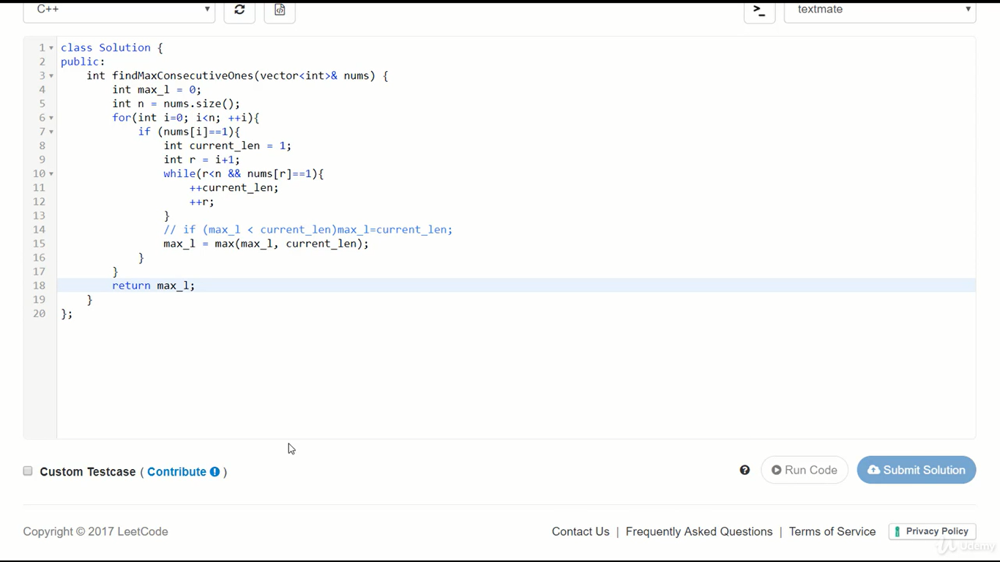

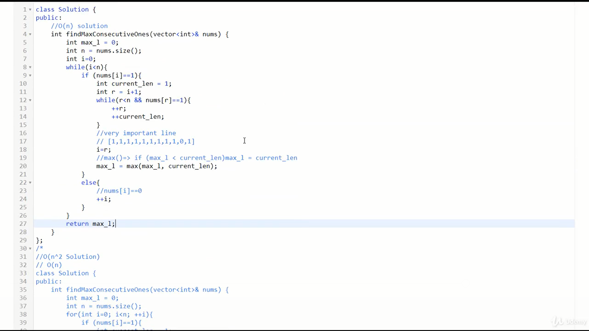

3. 

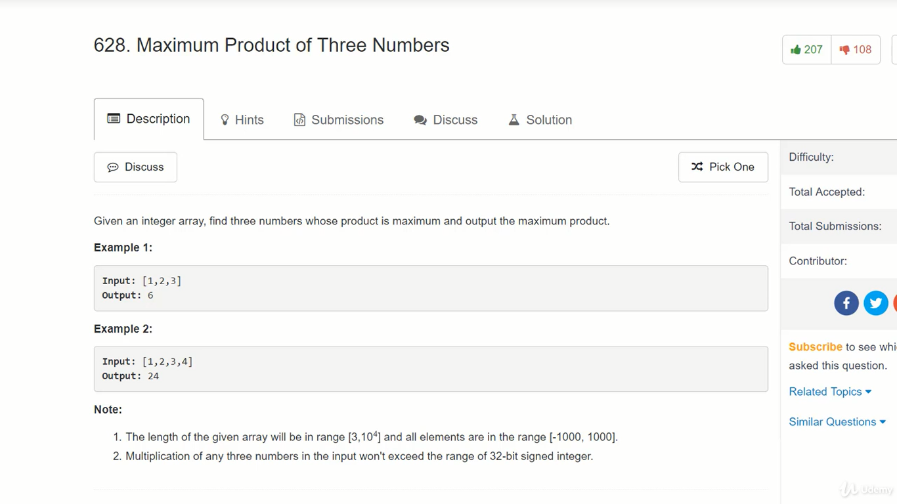

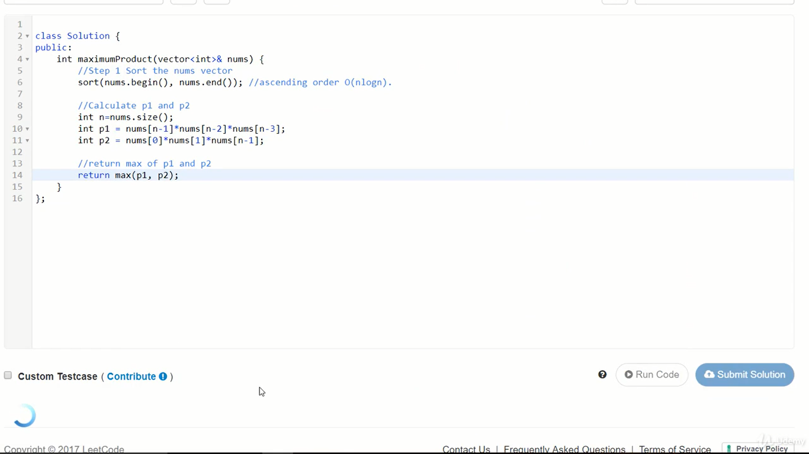

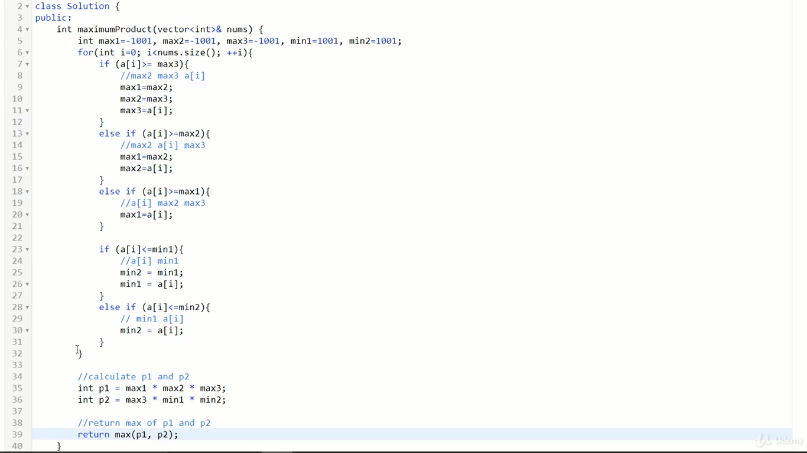

4. 

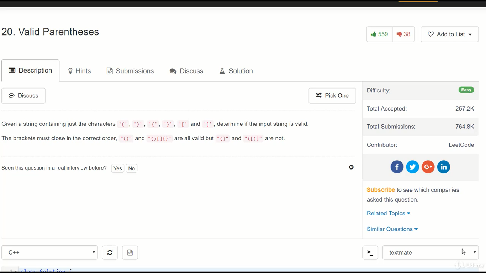
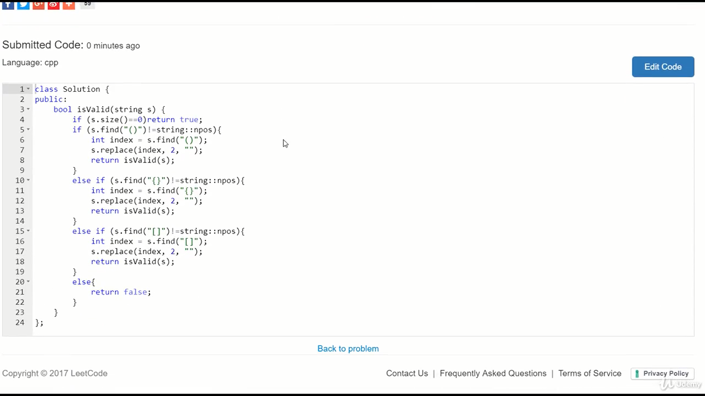
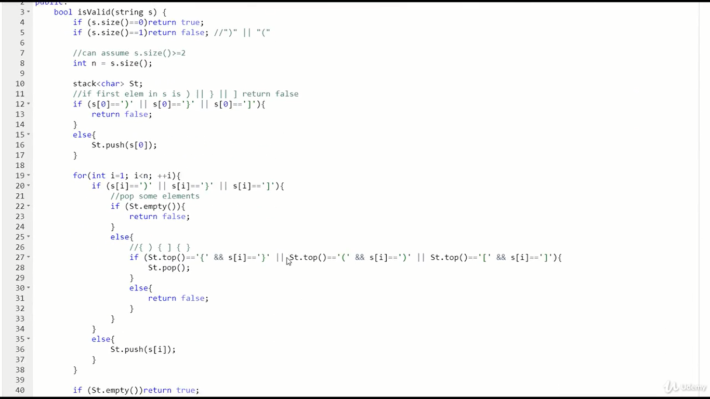

5. 

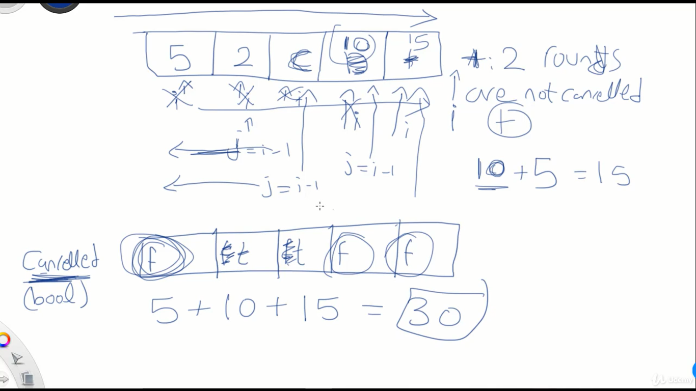

